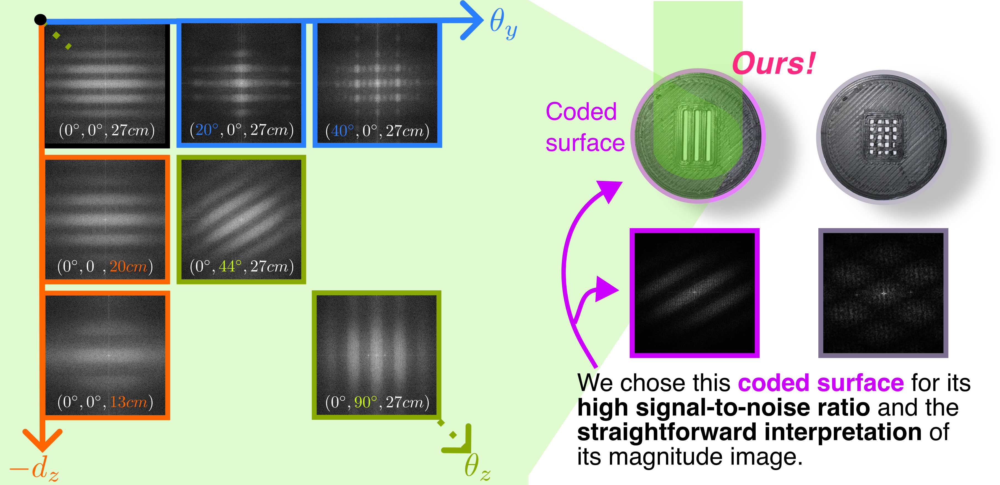

# SpecTrack: Learned Multi-Rotation Tracking via Speckle Imaging
[Ziyang Chen](https://ziyang.space/), [Mustafa Doğan](https://www.dogadogan.com/), [Josef Spjut](https://josef.spjut.me/) and [Kaan Akşit](https://kaanaksit.com)




[\[Website\]](https://complightlab.com/publications/spec_track/), [\[Manuscript\]](https://arxiv.org/pdf/2410.06028) 

# Citation
```bibtex
@inproceedings{chen2024spectrack,
  author = {Ziyang Chen and Mustafa Dogan and Josef Spjut and Kaan Ak{\c{s}}it},
  title = {SpecTrack: Learned Multi-Rotation Tracking via Speckle Imaging},
  booktitle = {SIGGRAPH Asia 2024 Posters (SA Posters '24)},
  year = {2024},
  location = {Tokyo, Japan},
  publisher = {ACM},
  address = {New York, NY, USA},
  pages = {2},
  doi = {10.1145/3681756.3697875},
  url = {https://doi.org/10.1145/3681756.3697875},
  month = {December 03--06}
}
```

## Getting started

### (0) Requirments

Before using this code in this repository, please make sure to have the right dependencies installed.
In order to install the main dependency used in this project, please make sure to use the below syntax in a Unix/Linux shell:

```bash
pip3 install -r requirements.txt
```

or

```bash
pip3 install git+https://github.com/kaanaksit/odak
```

or 

```bash
git clone git@github.com:kaanaksit/odak.git
cd odak
pip install -e .
```

### (1) Dataset

If training is needed, please download the training datasets from the [URL](https://rdr.ucl.ac.uk/ndownloader/articles/27232944/versions/1) and place the unzipped `motion_dataset2_fft` and `static_dataset3+4_fft`under the dataset folder.

### (2) Runtime
Once you have the main dependency installed, you can run the code base using the default settings by providing the below syntax:

```bash
git clone git@github.com:complight/SpecTrack.git
cd SpecTrack
python main.py --visual # with the speckle images showing in a window
```

If you want to train the model:
```bash
python train.py 

```
### (3) Reconfiguring the code for your needs
Please consult the settings file found in `settings/settings.txt`, where you will find a list of self descriptive variables that you can modify according to your needs.
This way, you can create a new settings file or modify the existing one.
By typing,
```bash
python main.py --help
```
or
```bash
python train.py --help
```
You can reach to the information for training and estimating using this work.


If you are willing to use the code with another settings file, please use the following syntax:
```bash
python main.py --settings settings/sample.txt
```
or
```base
python train.py --settings settings/sample.txt
```

## Description
In this repository you will find the cadebase for the learn model discussed in our work.
This work takes a captured laser speckle image from the lensless camera to estimate target surface rotatinal poses and depths.
If you need support beyond these `README.md` files, please do not hesitate to reach us using `issues` section.

## Support
For more support regarding the code base, please use the `issues` section of this repository to raise issues and questions or contact [Ziyang](mailto:ziyang.chen.22@ucl.ac.uk). 
